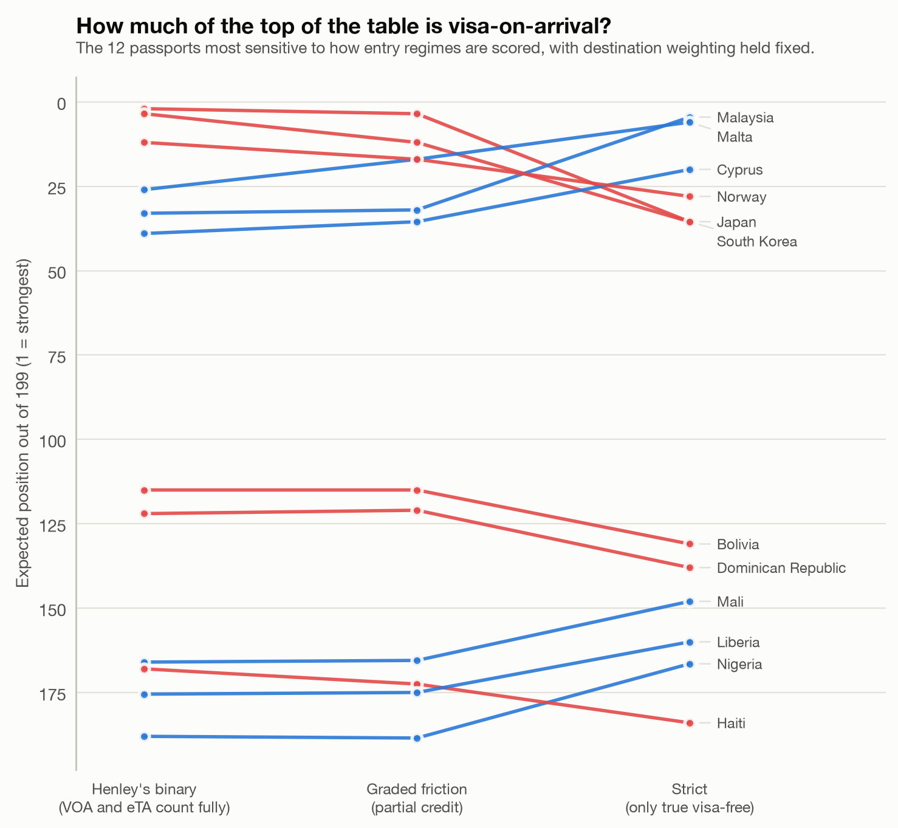
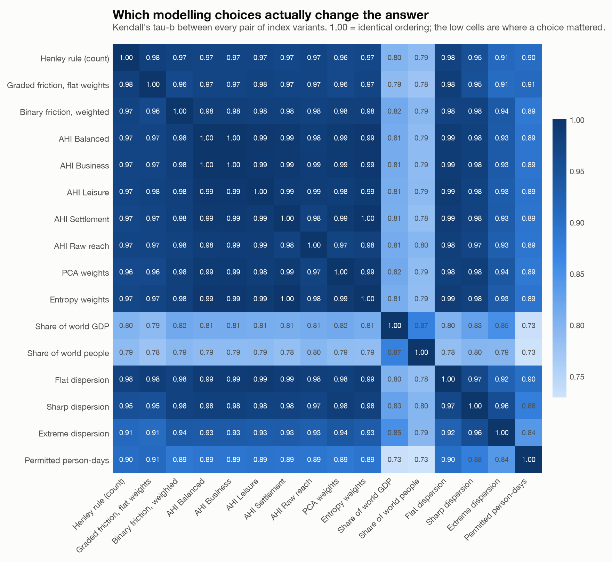
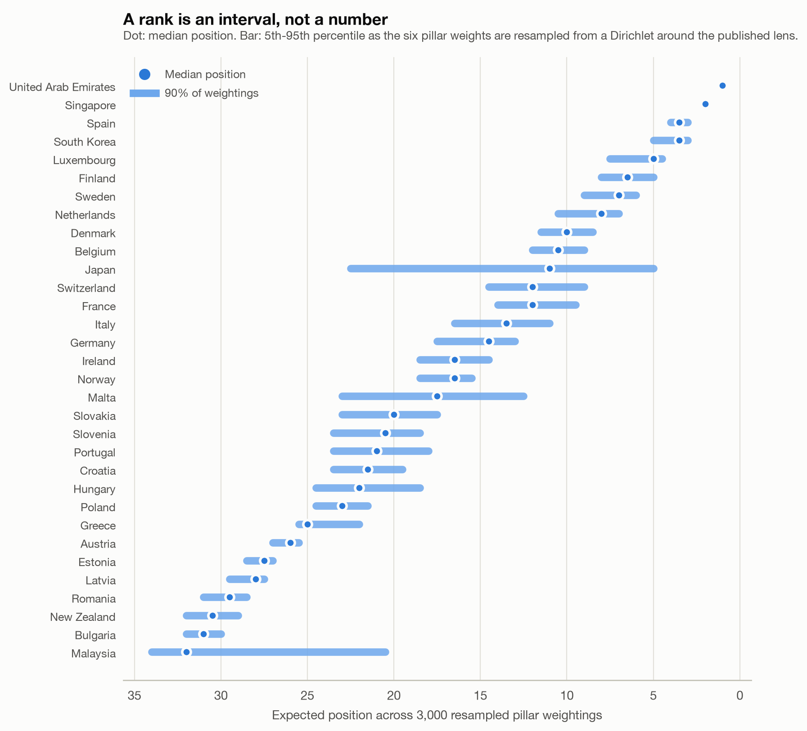
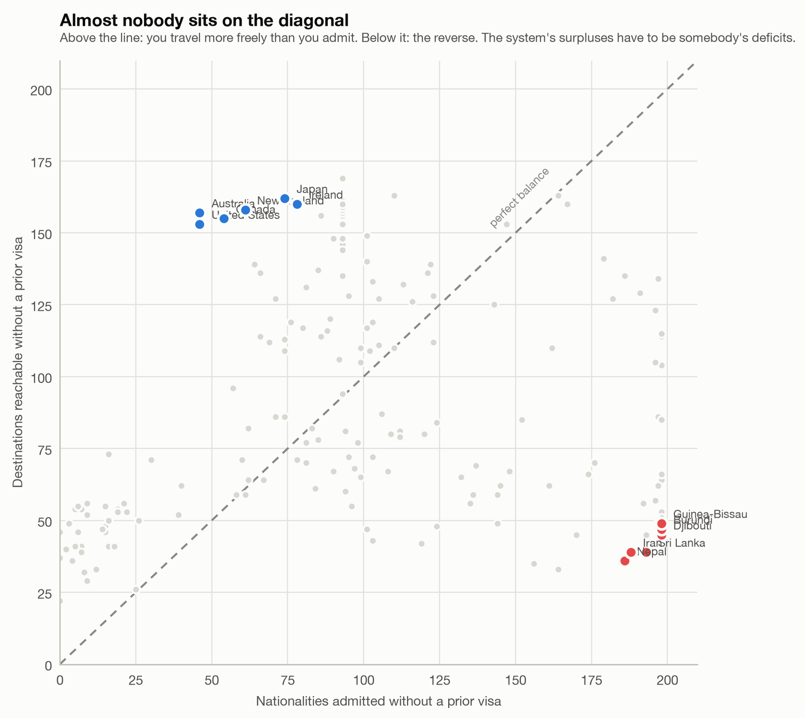
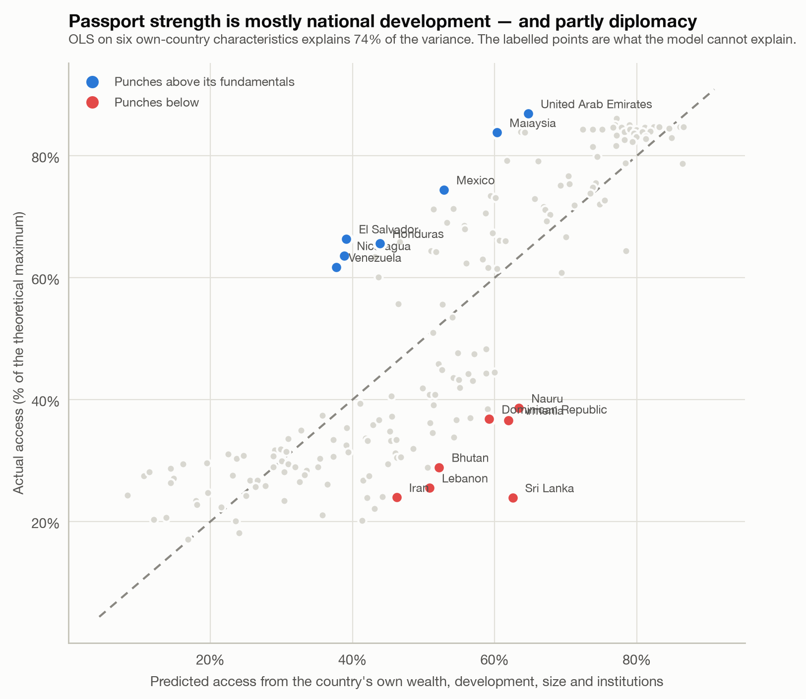
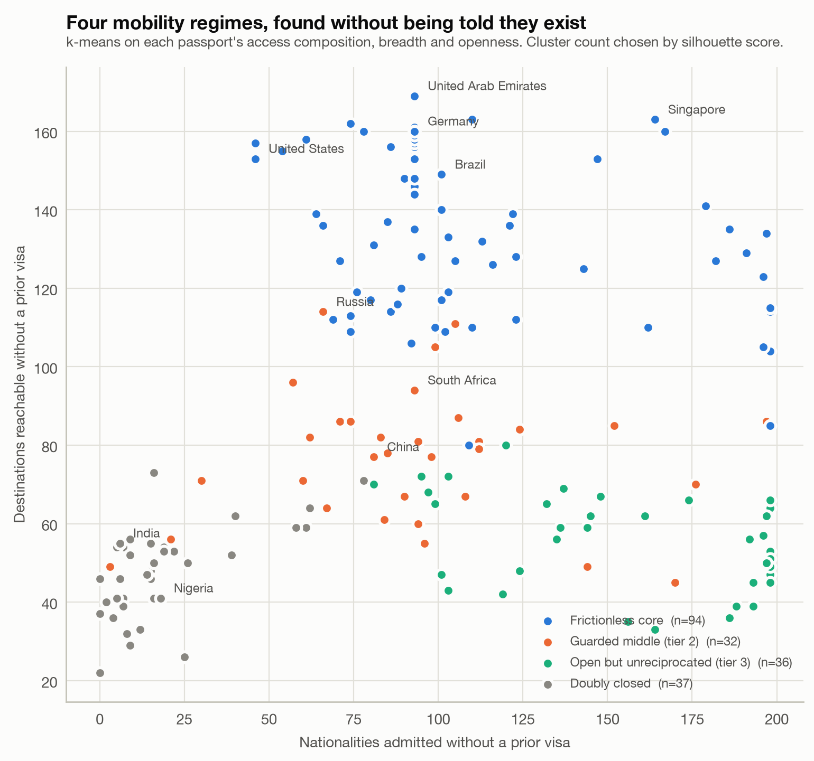

# One Point for Kiribati, One Point for the United States

### What happens when you stop counting passports and start weighing them

*An interactive version of this piece, with a clickable world map and a
sortable table of all 199 passports, is at
**[spencerrjenkins.github.io/adjusted-henley-index](https://spencerrjenkins.github.io/adjusted-henley-index/)**.
Every number below is generated by the pipeline in this repository; none is
typed by hand.*

---

## 1. The most-quoted number in travel is a sum of ones

Every few months a press release goes around the world. Singapore has the
strongest passport. Japan slipped to second. The American passport has fallen
out of the top ten for the first time. The number attached to each of these
stories comes from the **Henley Passport Index**, and Henley & Partners are
admirably clear about how they produce it:

> "All scores are binary (1 or 0), with no additional weighting or calculations
> applied. … The total score for each passport is equal to the number of
> destinations for which no visa is required."
> — [Henley Passport Index methodology](https://www.henleyglobal.com/passport-index/about)

Using IATA's Timatic database, they score 199 passports against 227
destinations. You get a point for a destination if you can board a plane without
first asking a government for permission — visa-free, visa-on-arrival, or an
electronic travel authorization all qualify. You get nothing if a visa is
required, and nothing if an e-Visa is required. In
[January 2026](https://www.henleyglobal.com/newsroom/press-releases/henley-global-mobility-report-january-2026)
this produced Singapore first with 192, Japan and South Korea second with 188,
and the United States tenth with 179. Afghanistan was last with 24.

It is a good index. It is transparent, cheap to audit, and almost impossible to
fudge — properties that most composite indicators would kill for. But binary
counting quietly asserts two things that nobody would defend if you made them
say it out loud.

**First: every destination is worth the same.** Kiribati has 130,000 people and
a GDP smaller than a mid-size American hospital system. The United States has
340,000,000 people and roughly a sixth of world output. In the Henley Index
they are worth one point each. So a passport that opens twelve Pacific
microstates outscores one that opens the United States, China, India and the EU
by eight points.

**Second: every frictionless entry is the same, and every non-frictionless one
is equally bad.** Walking through an automated e-gate in Amsterdam and queuing
for a visa-on-arrival stamp in a hot terminal are both worth exactly 1. Filling
in an online e-Visa form and waiting three days is worth exactly 0 — the same
score as being formally banned from the country.

The competing indices disagree so violently that the disagreement is itself the
finding. Arton Capital's Passport Index credits any form of facilitated entry
and folds in how welcoming a country is to others. The Nomad Passport Index adds
taxation, dual-citizenship rules and international reputation. Singapore is
first on Henley, joint second on Arton, and
[twentieth on Nomad](https://adamfayed.com/immigration-citizenship/most-powerful-passports-2025-index-comparison/).
Same world, same passports, three different questions — and only one of the
three tells you which question it is asking.

This project's argument is not that Henley is wrong. It is that **a flat count
is a weighting scheme too — it just never declares itself** — and that a
declared weighting scheme can be argued with, varied, and tested. So that is
what happens here: the weights are made explicit, then attacked from every angle
I could think of.

---

## 2. Why this is worth the trouble

Visa policy is one of the last forms of inequality that is written down
explicitly, in public, by governments, in a table.

The economics is not subtle. Neumayer's work on visa restrictions finds that
requiring a visa reduces bilateral trade by up to about a fifth and foreign
direct investment by up to a third; subsequent gravity-model work by Czaika and
Neumayer puts the reduction in travel flows between roughly 50% and 60%
([Neumayer 2011](https://www.sciencedirect.com/science/article/abs/pii/S0143622811000105);
[Czaika & Neumayer 2017](https://eprints.lse.ac.uk/74060/7/Neumayer_Visa%20restrictions%20and%20economic%20globalisation.pdf)).
A visa requirement is a tariff on human contact, and it is paid entirely by one
side.

The sociology is not subtle either. Mau and colleagues coined the term **global
mobility divide** for the pattern their data shows: visa liberalization has been
real in aggregate and radically unequal in distribution, with citizens of
wealthy states accumulating mobility rights while African citizens' rights
stagnated or went backwards
([Mau et al. 2015, *Journal of Ethnic and Migration Studies*](https://www.tandfonline.com/doi/abs/10.1080/1369183X.2015.1005007)).
Recchi and colleagues later showed the same divide in what a visa *costs*, which
varies by nationality for the identical document
([Recchi et al. 2021, *Political Geography*](https://www.sciencedirect.com/science/article/pii/S096262982100010X)).

When the headline instrument for measuring that divide treats a Pacific
microstate and a G7 economy as interchangeable units, it flattens precisely the
thing it is being used to measure.

---

## 3. How it was rebuilt

Every passport index ever published — Henley's, Arton's, Nomad's, this one — is
the same expression:

```
score(passport) = Σ over destinations d of  credit(passport → d) × weight(d)
```

Henley sets `credit` to a binary and `weight` to 1. This project varies both.

### The friction ladder

Instead of a binary, entry regimes get graded credit:

| Regime | Henley | Graded (default) | Strict |
|---|---|---|---|
| Visa-free | 1.00 | **1.00** | 1.00 |
| Visa on arrival | 1.00 | **0.85** | 0.00 |
| Electronic travel authorization | 1.00 | **0.70** | 0.00 |
| e-Visa | 0.00 | **0.35** | 0.00 |
| Visa required | 0.00 | **0.00** | 0.00 |
| No admission | 0.00 | **0.00** | 0.00 |

Those middle numbers are ordinal judgments, not measurements. So everything in
this project is computed under all three ladders, and any finding that only
survives one of them is reported as a finding about the ladder rather than about
passports.

### Six pillars from fifteen indicators

Each of the 199 destinations is scored on fifteen indicators — World Bank WDI,
UNDP's Human Development Report, V-Dem via Our World in Data, and a price level
derived from the ratio of nominal to PPP GDP — grouped into six pillars:

| Pillar | Question | Indicators |
|---|---|---|
| **Economy** | Can you earn, trade and transact there? | GDP per capita PPP, GDP PPP, trade openness |
| **Development** | Is it a functioning, connected, modern place? | HDI, internet penetration, tertiary enrollment |
| **Scale** | How much world sits behind the door? | Population, surface area |
| **Draw** | Do people want to go — and can flights get you there? | Tourist arrivals, tourism receipts, carrier departures |
| **Security** | Is the access safely and predictably usable? | Rule of law, electoral democracy, homicide rate |
| **Affordability** | How far does a visitor's money go? | Price level (inverted) |

Money- and count-denominated indicators are log-transformed (without it the
composite becomes a three-country index about the US, China and India),
winsorized at the 1st and 99th percentile, then min-max scaled. Pillars are
unweighted means of their members, so a weighting judgment is made exactly once
— at the pillar level, where there are six numbers to argue about instead of
fifteen.

### Five lenses, and two weightings nobody chose

A weight vector is a claim about *whose* mobility you are measuring, so the
project computes several: **Balanced**, **Business**, **Leisure**,
**Settlement**, and **Raw reach**. Alongside them sit two weightings derived
mechanically — one from the first principal component of the destination matrix,
one from Shannon entropy. Those two are the control group. If hand-set weights
and machine-derived weights tell the same story, the story is not an artifact of
the analyst.

And two variants need no weighting scheme at all, which makes them the most
literally interpretable numbers here: **the share of world GDP** and **the share
of world population** you can reach without asking permission.

### Checking the reproduction first

Before varying anything, the machinery is set to Henley's own positions — binary
credit, flat weights, dense ranking — and pointed at the open access matrix. It
should land countries in roughly the tiers Henley publishes. It does:

| Passport | Henley published rank | Reproduced rank |
|---|---|---|
| Singapore | 1 | 2 |
| Japan | 2 | 3 |
| South Korea | 2 | 2 |
| Denmark / Luxembourg / Spain / Sweden / Switzerland | 3 | 4–5 |
| UAE | 5 | 1 |
| New Zealand | 6 | 7 |
| Australia | 7 | 8 |
| Canada | 8 | 10 |
| Malaysia | 9 | 5 |
| United States | 10 | 11 |
| Afghanistan | 106 | 97 |

Twelve of fifteen reference points land within two places of the published rank
(Spearman ρ = 0.79). The scores differ in level because the destination universe
differs — 199 jurisdictions here against Henley's 227, since their IATA feed is
licensed and not redistributable — but the ordering barely does. The UAE is the
one conspicuous disagreement, and it is also the passport that moved most
between Henley's January and July 2026 releases, climbing to joint second.

A second, sharper check came free. Henley publishes an **Openness Index**
counting how many nationalities each country admits without a prior visa, and
reports that the United States admits **46**. Reconstructing that number from
the open matrix, independently, gives **46**. That test is now in the test suite.

---

## 4. Result: who actually moves

The biggest single casualty of weighting destinations is **Malaysia**. It sits
6th on the reproduced Henley count — but it shares that score with twelve other
passports, so its expected position among the 199 is really 12.0. Weighted, it
lands 32nd: an honest fall of twenty places. Malaysia's visa-free network is
genuinely wide, but it is disproportionately built from small and low-income
destinations. Russia falls 12.5 for the same reason.

Moving the other way are countries with narrow but well-aimed access: Kosovo
(+12.5), Laos (+11.5), Mongolia (+10.5), Vietnam and Cambodia (+10), India (+8).
Their comparatively few open doors happen to lead somewhere large. Luxembourg
gains 7 — not because it improved, but because it was buried inside that
thirteen-way tie and the weighted index can tell it apart from its neighbours.

Across all 199 passports, 92 fall and 84 rise, and the mean movement is exactly
zero. That is not luck; it is the point of the next section.

<picture>
  <source media="(prefers-color-scheme: dark)" srcset="output/figures/01_rank_movement.dark.png">
  
</picture>

### Why the movement numbers have a decimal point

Comparing two rankings with different tie structures is harder than it looks,
and getting it wrong manufactures findings. This project got it wrong twice.

**Mistake one: dense ranks.** Henley publishes *dense* ranks — "the passport
with the next lowest score receives the next consecutive rank number, regardless
of how many passports occupy the rank above" — which is why their table shows
the US at rank 10 with 36 passports actually ahead of it, and why Afghanistan,
dead last, appears at rank 97 in a faithful reproduction. Differencing dense
ranks against a continuous index is meaningless: the first compresses 199
passports into about 100 ranks and the second spreads them across 199. Done
naively it makes 193 of 199 countries "fall" and shows Afghanistan collapsing 74
places while remaining last on both indices.

**Mistake two: competition ranks.** Switching to competition ranking — a
three-way tie for first is followed by fourth — fixes the *scale*, and it is
what the tables here display. It does not fix the *comparison*, because it
awards every member of a tie the best position in the group: thirteen passports
tied on 160 destinations all become 6th when between them they occupy positions
6 through 18. Since 154 of the 199 passports sit in some tie under Henley's
integer scores and almost none do under a continuous weighted score, breaking
those ties can only push members downwards. The residual drift is about one rank
per passport — small, but always in the same direction, and enough to produce a
list of "fallers" (Ireland, Norway, Germany, Italy) that were not falling at all.

**The fix: fractional ranks.** A tied group sits at the average of the positions
it actually occupies, so the thirteen-way tie lands at 12.0. The sum of
fractional ranks is *n*(*n*+1)/2 whatever the tie structure, so both indices sit
on the same total, the mean movement is zero by construction, and what remains
is real reordering. All movement figures here are computed that way; competition
ranks are displayed, and dense ranks appear only where the point is to reproduce
Henley's published table.

---

## 5. Result: the friction ladder is the bigger lever

Of the two knobs, the one nobody argues about turns out to matter more.

Holding destination weights fixed and changing only how entry regimes are
scored moves the median passport 4 places and the most sensitive one 33.5. South
Korea and Japan sit at expected positions 2 and 3.5 under Henley's binary rule
and both fall to 35.5 under the strict rule, because a large share of their
access is visa-on-arrival rather than visa-free. Malaysia goes the other way —
from 33 to 4.5 — because its access is unusually *genuinely* visa-free.

<picture>
  <source media="(prefers-color-scheme: dark)" srcset="output/figures/04_ladder_sensitivity.dark.png">
  
</picture>

This is not a small caveat. It means a meaningful part of the ordering at the
top of the world's most-quoted passport table is an artifact of treating a
visa-on-arrival line as equivalent to an e-gate.

And there is a whole column in the source data that every published index throws
away: **the permitted length of stay**. 86% of visa-free pairs in the matrix
carry an explicit day count, ranging from 7 days to a year. Measured in
permitted person-days rather than doors, the ordering shifts noticeably — the
US, Israel and Trinidad and Tobago get about 81 days per destination on average,
while Myanmar, Iran and Cambodia get around 48. A 90-day Schengen right and a
14-day visa-on-arrival are one point each in every ranking on the market.

---

## 6. Result: the weighting barely matters — and that is the most useful finding

Here is the result that argues against this project's own premise, and it is the
one I would keep if I had to throw the rest away.

Across every variant — five hand-set lenses, PCA weights, entropy weights, three
levels of weight dispersion — **the rankings agree at Kendall's τ above 0.91**.
Resampling the six pillar weights 3,000 times from a Dirichlet wide enough to
cover any weighting a reasonable analyst could defend moves the median passport
by **two ranks**. The largest gap between the Business lens and the Leisure lens
anywhere in the table is six positions.

All of that is measured on fractional ranks too. Every variant here carries ties
— scores are rounded to one decimal before ranking, so between 9 and 154
passports share a score depending on the index — and each of these comparisons
puts two different tie structures side by side. On competition ranks the ladder
and normalization spreads would partly be spreads in tie counts rather than in
standing.

<picture>
  <source media="(prefers-color-scheme: dark)" srcset="output/figures/02_index_agreement.dark.png">
  
</picture>

Even deliberately stretching the gap between the most and least valuable
destination from 3.5× to 143× — by raising the composite to a power, which
changes the spread without changing the ordering of destinations — only pulls
the correlation with the plain count down to 0.91.

Why? Because averaging fifteen min-max-scaled indicators into six pillars, and
six pillars into one composite, is a variance sink. The resulting destination
weights span only **3.5×** from the most to the least valuable country, and the
Gini of destination weight is 0.15. The underlying data is nothing like that
flat: GDP per capita alone spans three orders of magnitude. **Any composite
built the standard way is far closer to a flat count than its authors intend**,
and that is a general result about composite indicators, not a fact about
passports.

<picture>
  <source media="(prefers-color-scheme: dark)" srcset="output/figures/03_monte_carlo_ranks.dark.png">
  
</picture>

The honest conclusion is not "our index is better." It is that arguing about
weighting schemes is mostly a distraction, and the choices that *do* move the
answer are the unglamorous ones: how you score an e-Visa, whether you count
days, and whether you look outbound or inbound.

---

## 7. Result: the divide is in the graph, not the weighting

Turn the matrix around and subtlety disappears.

The United States can reach 153 destinations without a prior visa and admits 46
nationalities on the same terms. Australia runs an even wider gap. At the other
end, 13 countries admit more than 190 nationalities while reaching fewer than 70
destinations themselves. Almost nobody sits on the diagonal.

<picture>
  <source media="(prefers-color-scheme: dark)" srcset="output/figures/07_reciprocity.dark.png">
  
</picture>

Sorted by World Bank income group, the pattern is stark:

| Income group | Countries | Mean access | Share of world population |
|---|---|---|---|
| High income | 66 | 77.0% | 17.0% |
| Upper middle income | 59 | 51.2% | 37.5% |
| Lower middle income | 47 | 34.2% | 35.9% |
| Low income | 25 | 26.5% | 9.3% |

Forty-five percent of humanity lives in the bottom two rows, at roughly a third
of the access the top row enjoys.

Measured as a Gini coefficient, mobility is distributed about as unequally as
income in a middle-income country: **0.26** under the plain count, **0.25**
under the weighted index, and **0.44** when you ask what share of world output
each passport opens. Weighting by people rather than by countries makes every
one of those figures worse, because weak passports are disproportionately held
by large populations.

The blocs make the same point structurally. Every political bloc in the data is
already essentially a free-movement area internally — EU-27, GCC, ASEAN,
Mercosur, Five Eyes and the Caribbean CBI states are all at 100% internal
frictionless density, and the CIS at 99%. The African Union is the sole
exception at **51%**. What separates the blocs is not internal cohesion but what
membership buys outside: a Five Eyes passport reaches 152 destinations beyond
the bloc, an EU passport 133, an African Union passport **31**.

---

## 8. Result: passports are made of institutions, and the residuals are diplomacy

Regressing each passport's attainment on its own country's wealth, human
development, population, rule of law, electoral democracy and trade openness
explains **74%** of the variance. Human development and electoral democracy
carry nearly all of it. GDP per capita adds nothing once HDI is in the model —
which is a collinearity result, not a finding about money: the two have variance
inflation factors above 11 and are not separately identified.

<picture>
  <source media="(prefers-color-scheme: dark)" srcset="output/figures/09_residuals.dark.png">
  
</picture>

The residuals are where the politics lives. The biggest over-performers are
El Salvador (+27 points above prediction), Nicaragua, Venezuela, Malaysia and
the UAE — countries whose mobility far outruns their fundamentals, generally
through regional free-movement arrangements or sustained bilateral waiver
diplomacy. The biggest under-performers are Sri Lanka (−39), Lebanon, Armenia,
Bhutan, Iran and Jordan: countries held down by something other than their
economy.

This is the quantitative version of an old observation. A passport is a
reputational asset. You cannot buy one by growing; you can only be trusted into
one.

---

## 9. Result: four regimes, and three blocs nobody was told about

k-means on each passport's access composition, breadth and openness — with the
cluster count chosen by silhouette score, taking the best k of at least three
because k = 2 merely recovers the rich/poor split everyone already knows —
separates the world into four regimes:

| Regime | Members | Reaches | Admits |
|---|---|---|---|
| Frictionless core | 94 | ~140 | ~107 |
| Guarded middle | 32 | ~77 | ~94 |
| Open but unreciprocated | 36 | ~56 | ~156 |
| Doubly closed | 37 | ~47 | ~18 |

The third row is the one worth staring at: 36 countries — largely African and
South Asian — that admit almost the entire world without a visa and can reach
about a quarter of it.

<picture>
  <source media="(prefers-color-scheme: dark)" srcset="output/figures/12_clusters.dark.png">
  
</picture>

Running Louvain community detection on the **mutual** access graph — where an
edge exists only if two countries admit each other, because one-way access is a
favor and mutual access is a relationship — recovers the political map without
being told it exists: a European cluster of 76, an African cluster of 89, and a
post-Soviet cluster of 31.

---

## 10. What the numbers are attached to

**The Emirati climb.** The UAE added 149 visa-free destinations in twenty years
and rose 57 places, the strongest performer in the index's history — the product
of a deliberate, sustained program of bilateral waiver negotiation. It tops
this project's reproduction too, and unusually it holds position across every
lens, because its access is broad rather than regionally concentrated.

**The American slide is a reciprocity story.** The US has gone from first in
2006 to tenth in 2026, the third-largest twenty-year decline after Venezuela and
Vanuatu. The mechanism visible in this data is not that the US lost access — it
is that it never bought more. Admitting 46 nationalities while reaching 153
destinations leaves nothing to trade with, and waivers are traded. Henley's own
Openness Index puts the US 78th of 199.

**China is buying reach with openness.** China extended unilateral visa-free
entry through 2025 and 2026 — adding Sweden in November 2025 and the UK and
Canada from February 2026 — and now admits 77 nationalities, more than the US.
Because China is one of the largest single blocks of weight in any
destination-weighted index, each of those waivers moves other countries' scores
far more than a typical bilateral deal, which is exactly why several Southeast
and Central Asian passports gain under weighting here.

**Passports for sale, and the ceiling on them.** Citizenship-by-investment
programs sell precisely the thing this index measures. In April 2025 the
[European Court of Justice ruled Malta's scheme unlawful](https://www.asil.org/insights/volume/29/issue/8),
holding that a member state cannot make nationality — and with it EU citizenship
— "a mere commercial transaction." The Caribbean programs that remain sell
access to a measurably narrower world.

**The binary is about to get blurrier.** The EU's ETIAS authorization,
repeatedly delayed and now expected no earlier than 2027, will convert visa-free
entry to Europe into an electronic travel authorization for more than sixty
nationalities. Under Henley's rule that changes nothing — an ETA still scores 1.
Under any graded reading it is a real increase in friction for an enormous number
of travelers, and it will not appear in the headline number at all.

---

## 11. What this cannot tell you

- **It is not Henley's data.** Their IATA Timatic feed is licensed and not
  redistributable. This uses the open passport-index matrix — 199 × 199 rather
  than 199 × 227 — so scores are not comparable in level, only in order.
- **The friction ladder is a judgment.** 0.85 for visa-on-arrival is defensible,
  not measured. Every result is therefore reported under all three ladders.
- **Some data is stale by construction.** Tourist arrivals and receipts have a
  median vintage of 2020: the pandemic broke the series and it has not fully
  recovered. Treated as a structural signal of draw, not a current-year figure.
- **7% of indicator cells are imputed, proxied or hand-sourced**, mostly for
  jurisdictions the multilateral agencies do not report separately. Dropping
  every poorly-measured destination and rescoring moves the median passport by
  one rank — so the conclusions do not rest on them — but the individual numbers
  for Vatican City, North Korea and Kosovo should be read as estimates.
- **It is a snapshot.** The matrix has no time dimension. The twenty-year claims
  above are Henley's, cited, not reproduced.
- **A visa is not a border.** Being legally admissible is not being admitted.
  Nothing here measures secondary screening, carrier checks, or how a passport is
  actually treated at a desk.

---

## Sources

**Data**

- Passport access matrix — [imorte/passport-index-data](https://github.com/imorte/passport-index-data)
- World Development Indicators — [World Bank](https://data.worldbank.org/)
- Human Development Report 2025 — [UNDP](https://hdr.undp.org/)
- V-Dem rule of law and electoral democracy — [Our World in Data](https://ourworldindata.org/)
- Country reference data — [mledoze/countries](https://github.com/mledoze/countries)

**Method**

- OECD & JRC, *[Handbook on Constructing Composite Indicators: Methodology and User Guide](https://www.oecd.org/en/publications/handbook-on-constructing-composite-indicators-methodology-and-user-guide_9789264043466-en.html)* (2008)

**Comparison and context**

- [Henley Passport Index methodology](https://www.henleyglobal.com/passport-index/about) and [Global Mobility Report, January 2026](https://www.henleyglobal.com/newsroom/press-releases/henley-global-mobility-report-january-2026)
- Neumayer, E. (2011), *[On the detrimental impact of visa restrictions on bilateral trade and foreign direct investment](https://www.sciencedirect.com/science/article/abs/pii/S0143622811000105)*, Applied Geography
- Czaika, M. & Neumayer, E. (2017), *[Visa restrictions and economic globalisation](https://eprints.lse.ac.uk/74060/7/Neumayer_Visa%20restrictions%20and%20economic%20globalisation.pdf)*, Applied Geography
- Mau, S. et al. (2015), *[The Global Mobility Divide: How Visa Policies Have Evolved over Time](https://www.tandfonline.com/doi/abs/10.1080/1369183X.2015.1005007)*, Journal of Ethnic and Migration Studies 41(8)
- Recchi, E., Deutschmann, E., Gabrielli, L. & Kholmatova, N. (2021), *[The global visa cost divide](https://www.sciencedirect.com/science/article/pii/S096262982100010X)*, Political Geography
- [Commodifying Citizenship: The ECJ Rules Against Malta's "Golden Passport" Program](https://www.asil.org/insights/volume/29/issue/8), ASIL Insights (2025)
- [China Visa-Free Travel: A Complete Guide](https://www.china-briefing.com/news/china-visa-free-travel-policies-complete-guide/), China Briefing
- [ETIAS launch timeline](https://etias.com/articles/etias-drops-2026-date-as-launch-slips-out-of-view)

---

*Method, code and every intermediate table:
[github.com/spencerrjenkins/adjusted-henley-index](https://github.com/spencerrjenkins/adjusted-henley-index).
Reproduce with `make all`.*
