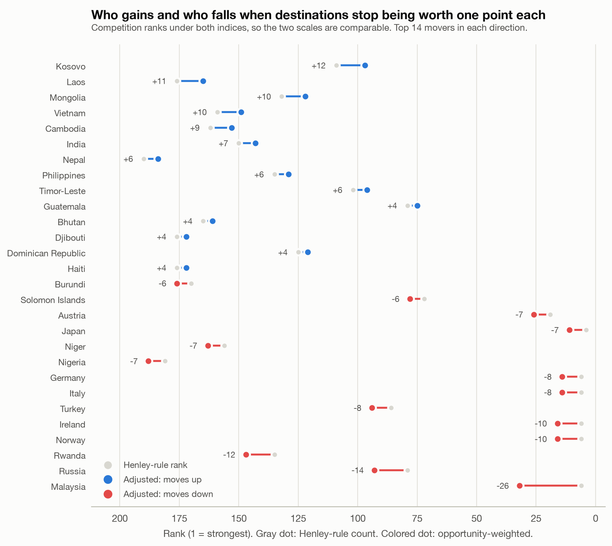

# Adjusted Henley Index

**An opportunity-weighted rebuild of the Henley Passport Index — with the weighting made explicit, and then stress-tested until it admits how little it matters.**

[](https://github.com/spencerrjenkins/adjusted-henley-index/actions/workflows/ci.yml) [](pyproject.toml) [](#license)

📊 **[Interactive data story →](https://spencerrjenkins.github.io/adjusted-henley-index/)** · 📝 **[Long-form article →](ARTICLE.md)**

<picture>
  <source media="(prefers-color-scheme: dark)" srcset="output/figures/01_rank_movement.dark.png">
  
</picture>

---

## The one-paragraph version

The Henley Passport Index scores a passport by *counting* destinations reachable without a prior visa: Kiribati and the United States are worth one point each, and an e-Visa is worth the same as being banned. This project rebuilds that index with destinations weighted by a six-pillar composite of what is actually behind the door, entry regimes scored on a graded friction ladder instead of a binary, and twelve index variants computed side by side. It then does the thing rankings almost never do — **uncertainty and sensitivity analysis** — and reports the result even though the result undercuts the premise: across every reasonable weighting the rankings agree at Kendall's τ > 0.91, and the choices that genuinely move the answer are how you score an e-Visa, whether you count permitted days, and whether you look outbound or inbound.

**The transferable finding is about composite indicators, not passports.** The reason re-weighting cannot move these rankings is that min-max scaling a basket of indicators and averaging it twice absorbs most of the variance the weights would have had to act on — before any weight is chosen. Any index built the standard way is far closer to a flat count than its authors intend, and its published weighting scheme is doing less work than the methodology note beside it implies. This project is a worked demonstration of that on a well-known index.

---

## How this was made

Built with heavy LLM assistance. The framing, the modeling choices, the ranking-convention analysis and the decision to publish the result that undercuts the premise are mine.

Stated plainly because the interesting question is not whether an assistant was used but whether the work holds up, and this repository is built so that it can be checked rather than taken on trust: every judgment call is in one file ([`src/ahi/config.py`](src/ahi/config.py)), every number in the article and on the site is regenerated from raw data by `make run`, the site build fails if the prose references a figure the pipeline cannot supply, and CI rebuilds every artifact on each push and fails if a committed table disagrees with the rebuild.

---

## Quickstart

```bash
git clone https://github.com/spencerrjenkins/adjusted-henley-index
cd adjusted-henley-index
make all          # venv + install, fetch data, run pipeline, run tests
make serve        # preview the data story at http://localhost:8000
```

Or without `make`:

```bash
python3 -m venv .venv && .venv/bin/pip install -r requirements.txt
export PYTHONPATH=src
.venv/bin/python -m ahi.ingest.fetch    # ~20 files into data/raw/
.venv/bin/python -m ahi.pipeline        # tables, figures, results.json, docs/
.venv/bin/python -m pytest
```

Full run: about 3 seconds on a laptop after the data is cached. Every artifact in `output/` and `docs/` is generated — nothing there is edited by hand.

| Target | What it does |
| --- | --- |
| `make fetch` | Download every upstream source into `data/raw/` (cached; `make refetch` forces) |
| `make run` | Build 36 tables, 15 figures × 2 themes, `results.json`, and `docs/` |
| `make test` | 27 invariant tests |
| `make verify` | Assert the committed outputs match a clean rebuild |
| `make serve` | Local preview of the data story |
| `make clean` | Remove generated outputs, keep raw data |

---

## What the index actually is

Every passport index ever published is the same expression:

```
score(passport p) = Σ over destinations d of   credit(p → d) × weight(d)
```

Henley sets `credit` to a binary and `weight(d) = 1` for every destination on Earth. That is not the absence of a modeling choice — it is a strong one. This project varies both terms and reports which conclusions survive.

### `credit` — the friction ladder

| Entry regime | `binary_henley` | `graded` (default) | `strict` |
| --- | --- | --- | --- |
| Visa-free (incl. explicit day counts) | 1.00 | **1.00** | 1.00 |
| Visa on arrival | 1.00 | **0.85** | 0.00 |
| Electronic travel authorization (eTA) | 1.00 | **0.70** | 0.00 |
| e-Visa | 0.00 | **0.35** | 0.00 |
| Visa required | 0.00 | **0.00** | 0.00 |
| No admission | 0.00 | **0.00** | 0.00 |

Defined in [`src/ahi/config.py`](src/ahi/config.py). The graded values are ordinal judgments, not measurements, so every result is recomputed under all three ladders — see `output/tables/11_ladder_sensitivity.csv`.

The source matrix also records **permitted stay in days** for 86% of visa-free pairs. Every published index discards that column; this one keeps it as the `stay_days` variant.

### `weight` — fifteen indicators, six pillars

| Pillar | Question it answers | Indicators |
| --- | --- | --- |
| **Economy** | Can you earn, trade and transact there? | GDP per capita PPP · GDP PPP · trade openness |
| **Development** | Is it a functioning, connected, modern place? | HDI · internet penetration · tertiary enrollment |
| **Scale** | How much world sits behind the door? | Population · surface area |
| **Draw** | Do people want to go, and can flights get you there? | Tourist arrivals · tourism receipts · carrier departures |
| **Security** | Is the access safely and predictably usable? | Rule of law (V-Dem) · electoral democracy (V-Dem) · homicide rate ⁻ |
| **Affordability** | How far does a visitor's money go? | Price level ⁻ |

⁻ = lower is better; the normalized column is direction-corrected.

**Pipeline per indicator:** latest observation → vintage floor (anything before 2012 is treated as missing, except tourism where the whole world is pre-pandemic) → manual patch or country proxy → peer-group imputation → log transform where skewed → winsorize at [1%, 99%] → min-max to [0, 1].

**Pillar score** = unweighted mean of its indicators. Weighting happens exactly once, at the pillar level, where there are six numbers to argue about instead of fifteen.

### The index family

| Variant | Weighting | What it answers |
| --- | --- | --- |
| `henley` | flat, binary ladder | Henley's own rule, reproduced |
| `graded_count` | flat, graded ladder | isolates the friction ladder's effect |
| `binary_weighted` | composite, binary ladder | isolates the weighting's effect |
| `ahi_balanced` | all six pillars | **headline** — the world on every axis at once |
| `ahi_business` | economy + scale heavy | how much economic activity you can show up to |
| `ahi_leisure` | draw + affordability heavy | how much of the world worth visiting |
| `ahi_settlement` | development + security heavy | where you could plausibly live |
| `ahi_reach` | economy + scale only | how many people and how much output |
| `ahi_pca` | first principal component | control: weights nobody chose |
| `ahi_entropy` | Shannon entropy | control: weights nobody chose |
| `ahi_gamma_{flat,sharp,extreme}` | composite ^ γ | tests sensitivity to weight *dispersion* |
| `gdp_share` | GDP PPP, unit-denominated | % of world output reachable — no weighting scheme at all |
| `pop_share` | population, unit-denominated | % of humanity reachable |
| `stay_days` | permitted days × credit | person-days of frictionless presence |

Plus the inbound mirror: `openness_count` (Henley's own Openness Index), `openness_graded`, and `openness_people_pct` — how many *people*, not countries, you admit.

### Three ranking conventions, each with one job

Comparing two rankings with different tie structures is the subtlest thing in this project, and it has two failure modes rather than one.

**Dense** (`*_rank`) is Henley's published convention: *"the passport with the next lowest score receives the next consecutive rank number, regardless of how many passports occupy the rank above."* That is why their table shows the US at rank 10 with 36 passports ahead of it, and why Afghanistan — dead last — appears at rank 97 in a faithful reproduction. Reproducing it exactly is the point; using it for comparison is not. An integer count compresses 199 passports into ~100 ranks while a continuous score spreads them across 199, so differencing the two makes 193 of 199 countries "fall".

**Competition** (`*_pos`, the `1224` rule) fixes the scale and is what the tables and the website display — Afghanistan is 199th. But it still awards every member of a tie the *best* position in the group: thirteen passports tied on 160 destinations all become 6th, when between them they occupy positions 6–18. With 154 of 199 passports in some tie under Henley and almost none under a continuous score, breaking ties can only push members down. The residual drift is ≈ 1 rank per passport, always in the same direction — enough to produce a list of "fallers" (Ireland, Norway, Germany, Italy) that were not falling at all.

**Fractional** (`*_frac`) puts a tied group at the average of the positions it occupies, so the thirteen-way tie lands at 12.0. Because the sum of fractional ranks is *n*(*n*+1)/2 for *any* tie structure, both indices sit on the same total: mean movement is **zero by construction** and what remains is real reordering. **All movement analysis uses this.** With it, 92 passports fall and 84 rise instead of 104 and 54.

| Column | Convention | Used for |
|---|---|---|
| `*_rank` | dense (`1223`) | reproducing Henley's published table |
| `*_pos` | competition (`1224`) | display: "what position is this passport" |
| `*_frac` | fractional (`1.5, 1.5, 3, 4`) | **all cross-index movement and agreement** |

**Scope.** This is not only about the headline movement figure. Scores are rounded to one decimal before ranking — we should not claim to separate passports more finely than we report them — so *every* variant carries ties, from 9 passports (`stay_days`) to 154 (`henley`). Every analysis that compares two rankings therefore uses fractional ranks: rank movement, index agreement, the ladder / normalization / imputation sensitivities, and the Monte Carlo rank intervals. Competition ranks survive only as display.

Two tests guard this: fractional ranks must sum to *n*(*n*+1)/2 for every variant, and the mean movement between any two indices must be zero — with an assertion that the naive competition-rank version really is biased, so the test guards a live hazard rather than restating an identity.

---

## Repository layout

```
├── Makefile                    one-command reproduction
├── pyproject.toml              package metadata, console scripts
├── requirements.txt            pinned versions the published figures came from
├── ARTICLE.md                  the long-form write-up
├── .github/workflows/ci.yml    tests + rebuild-and-diff, on every push
│
├── src/ahi/
│   ├── config.py               ⭐ every judgment call, in one auditable file
│   ├── features.py             load → patch → impute → normalize → pillars
│   ├── indices.py              the index family, ranking conventions, openness
│   ├── pipeline.py             end-to-end orchestration
│   ├── regen_check.py          fails if a committed artifact ≠ a clean rebuild
│   ├── ingest/
│   │   ├── fetch.py            downloads all sources, writes MANIFEST.json
│   │   └── access.py           parses the matrix into a graded edge list
│   ├── analysis/
│   │   ├── sensitivity.py      Monte Carlo, ladder/normalization/imputation, Kendall
│   │   ├── network.py          reciprocity, centrality, Louvain communities, blocs
│   │   ├── inequality.py       Gini, Lorenz, concentration, the divide
│   │   └── models.py           OLS + VIF, k-means typology
│   └── viz/
│       ├── theme.py            palette slots, light/dark matplotlib theming
│       ├── figures.py          the 15-figure suite
│       └── site.py             builds docs/ from tables + templates
│
├── data/
│   ├── raw/                    downloaded sources + MANIFEST.json (URL, SHA-256, vintage)
│   ├── manual/                 hand-sourced patches, each with a citation column
│   └── processed/              denormalized master tables
│
├── assets/
│   ├── world_paths.js          Natural Earth 110m geometry, baked to SVG paths
│   └── site/                   the data story: HTML template, CSS,
│       ├── charts.js           dependency-free SVG chart engine + 16 charts,
│       │                       4 explanatory diagrams, live weight explorer
│       └── site.js             map, ranking table, detail panel, theme
│
├── output/
│   ├── tables/                 36 CSVs, one per analysis step
│   ├── figures/                15 figures × light/dark
│   └── results.json            every number the article and site quote
│
├── docs/                       ← GitHub Pages site (generated)
└── tests/                      27 invariant tests
```

---

## Data sources

| Source | Series | Notes |
| --- | --- | --- |
| [imorte/passport-index-data](https://github.com/imorte/passport-index-data) | 199 × 199 access matrix | Open successor to `ilyankou/passport-index-dataset`; same categories Henley uses. Henley's own IATA Timatic feed is licensed and not redistributable. |
| [World Bank WDI](https://data.worldbank.org/) | 12 indicators | Pulled via the JSON API with `mrnev=1`, which returns the latest value **and its year** per economy |
| [UNDP HDR 2025](https://hdr.undp.org/) | HDI | Data through 2023 |
| [Our World in Data](https://ourworldindata.org/) | V-Dem rule of law, electoral democracy | |
| [mledoze/countries](https://github.com/mledoze/countries) | centroids, area, languages, borders, subregion | |

Every downloaded file is recorded in `data/raw/MANIFEST.json` with its URL, byte size, SHA-256 and fetch timestamp, so you can tell whether the numbers you are reading came from the same bytes as the ones published here.

### Data honesty

**Vintage floor.** The World Bank carries a country's last reported figure forward indefinitely, so a naive "latest non-null" pull happily returns a 1994 tertiary-enrollment number next to a 2025 GDP number. Anything older than 2012 fails the floor and is imputed instead, with the substitution recorded. Tourism is exempt because the entire world's latest data is pre-pandemic and dropping it would delete the pillar — its median vintage is 2020, and it is treated as a structural signal of draw rather than a current-year figure.

**Imputation.** Hot-deck from the narrowest available peer group: income group → World Bank region → UN subregion → global median. A missing microstate looks far more like other high-income microstates than like the world median.

**Manual patches.** [`data/manual/manual_overrides.csv`](data/manual/manual_overrides.csv) covers jurisdictions the multilateral agencies do not report separately — Taiwan, Kosovo, North Korea, Vatican City, Monaco, Liechtenstein, San Marino, Andorra, Macao, Cuba. Two mechanisms: a hand-entered value with its source named in a column, or a **country proxy** for cases where the honest answer is not "we estimate X" but "administratively, this *is* that place" — Vatican City's price level is Italy's; Liechtenstein's air connectivity is Switzerland's. A patch only ever fills a genuinely-missing cell; a real observation always wins.

Overall **93% of indicator cells are directly observed**. Per-cell provenance is in `output/tables/02b_provenance_cells.csv`.

**Sensitivity to all of it:** dropping every destination with more than three non-observed cells and rescoring moves the median passport by **one rank** (`output/tables/13_imputation_sensitivity.csv`).

---

## Validation

Setting the machinery to Henley's own positions and pointing it at the open matrix should land countries in the tiers Henley publishes. It does — 12 of 15 reference points from their January 2026 report land within two places (Spearman ρ = 0.79); see `output/tables/16_henley_validation.csv`.

A sharper check came free. Henley's Openness Index reports the United States admits **46** nationalities without a prior visa. Reconstructing that number independently from the open matrix gives **46**. It is now a test:

```python
def test_openness_matches_published_us_figure(edges, features):
    openness = openness_frame(edges, features).set_index("passport")
    assert openness.at["USA", "openness_count"] == 46
```

The test suite guards the class of bug that produces a plausible-looking wrong answer rather than a crash: dense-vs-competition ranking, direction-corrected indicators (a flipped homicide sign would invert the security pillar invisibly), the reduction to a plain count when both knobs are at Henley's positions, and inbound/outbound totals matching.

---

## Findings

**1 · Weighting destinations moves fewer passports than you would expect.** Malaysia falls 20 places (expected position 12.0 → 32.0); Russia 12.5. Kosovo, Laos, Mongolia, Vietnam and Cambodia gain 10–12.5. 92 passports fall, 84 rise, mean movement exactly zero — almost everyone moves by single digits.

**2 · The friction ladder is the bigger lever.** Holding weights fixed and changing only how entry regimes are scored moves the median passport 4 places and the most sensitive 33.5. South Korea and Japan sit at expected positions 2 and 3.5 under Henley's binary rule and both fall to 35.5 under a strict rule, because much of their access is visa-on-arrival.

**3 · The compositing recipe is a variance sink — and that, not the passport result, is the finding.** Min-max scaling 15 indicators and averaging them into 6 pillars into 1 composite yields destination weights spanning a **3.5× spread** (Gini 0.15) out of underlying data where GDP per capita alone spans three orders of magnitude. That spread is a property of the pipeline, not a measurement of the world — which is exactly why it generalizes. 3,000 Dirichlet-resampled weightings move the median passport **2 ranks**; even a 143× artificial spread only pulls τ against the plain count down to 0.91; swapping min-max for rank or z-score normalization moves the median passport 1 rank. *Any index built by min-max scaling a basket of indicators and averaging it is far closer to a flat count than its authors intend, and its published weighting scheme is doing less work than the methodology note beside it implies.* The boundary: it is *linear* aggregation that does the damage, so geometrically aggregated composites (HDI since 2010) resist it — which is close to why the HDI changed.

**4 · The divide is in the graph, not the weighting.** High-income countries average 77% attainment (17% of world population); lower-middle and low income average 34% and 26% (45% of world population). Gini of mobility: 0.26 by count, 0.44 by share-of-world-GDP. The US reaches 153 and admits 46.

**5 · Passports are institutions, and the residuals are diplomacy.** OLS on own wealth, HDI, population, rule of law, democracy and trade openness explains **74%** of variance; HDI and electoral democracy carry nearly all of it (GDP per capita is collinear, VIF > 11). Biggest over-performers: El Salvador, Nicaragua, Venezuela, Malaysia, UAE. Biggest under-performers: Sri Lanka, Lebanon, Armenia, Bhutan, Iran.

**6 · Four regimes, recovered without supervision.** k-means finds a frictionless core (94), a guarded middle (32), an **open but unreciprocated** group of 36 that admits ~156 nationalities while reaching ~56 destinations, and 37 doubly closed. Louvain on the *mutual* access graph reconstructs the political map: European cluster of 76, African of 89, post-Soviet of 31.

**7 · Every bloc is already a free-movement area — except one.** EU-27, GCC, ASEAN, Mercosur, Five Eyes and the Caribbean CBI states all sit at 100% internal frictionless density; the African Union at 51%. What differs is external reach: Five Eyes 152 destinations, EU 133, African Union 31.

---

## Output reference

<details>
<summary><b>All 36 tables in <code>output/tables/</code></b></summary>

| File | Contents |
| --- | --- |
| `01_access_categories` | Entry-regime counts, shares, median stay, credit per ladder |
| `02_data_provenance` · `02b_provenance_cells` | Observed/manual/proxied/imputed, by indicator and by cell |
| `03_indicator_registry` | Every indicator with source, code, direction, transform, median vintage |
| `04_index_family` | All variants: score, dense rank, competition position, attainment % |
| `05_pillar_contributions` · `05b_pillar_attainment` | Per-passport pillar decomposition and tilt |
| `06_openness` | Inbound: count, graded, population-weighted |
| `07_destination_weights` | Weight per destination under every lens and γ |
| `08_destination_features` | Raw, normalized and pillar values per destination |
| `09_datadriven_weights` | PC1 loadings and entropy weights |
| `10_monte_carlo_ranks` · `10b_..._weight_draws` | Rank intervals (fractional); the sampled weight distribution |
| `11_ladder_sensitivity` | Rank under each friction ladder (fractional) |
| `12_normalization_sensitivity` | Rank under min-max / rank / z-score |
| `13_imputation_sensitivity` | Rank with poorly-measured destinations dropped |
| `14_index_agreement` | Kendall τ-b between every pair of variants |
| `15_rank_movement` | Movement (fractional) decomposed into weighting vs friction effects, with competition positions alongside |
| `16_henley_validation` · `16b_weight_dispersion` | Published vs reproduced; γ sweep |
| `17_reciprocity` | Reaches, admits, balance, reciprocated share |
| `18_centrality` | PageRank as destination and as passport, betweenness |
| `19_communities` | Louvain communities on the mutual access graph |
| `20_blocs` | Internal density and external reach per bloc |
| `21_asymmetry_pairs` | Largest one-way relationships by combined population |
| `22_mobility_inequality` | Gini by country and by person, p90/p10, per variant |
| `23_divide_by_income` · `24_divide_by_region` | The divide, tabulated |
| `25_access_to_wealth` | Reachable vs own share of world GDP |
| `26_lorenz_passports` | Lorenz curve points |
| `27_strength_residuals` · `28_strength_coefficients` · `28b_variance_inflation` | Regression |
| `29_passport_clusters` · `30_cluster_profiles` · `31_cluster_silhouette` | Typology |

</details>

<details>
<summary><b>All 15 figures in <code>output/figures/</code></b> (each rendered in light and dark)</summary>

`01_rank_movement` · `02_index_agreement` · `03_monte_carlo_ranks` · `04_ladder_sensitivity` · `05_weight_distribution` · `06_pillar_profiles` · `07_reciprocity` · `08_lorenz` · `09_residuals` · `10_divide_by_income` · `11_pca_loadings` · `12_clusters` · `13_weight_dispersion` · `14_blocs` · `15_stay_days`

</details>

`output/results.json` is the machine-readable bundle of every figure the article and website quote. The site build **fails** if the template references a number the pipeline cannot supply, which is what keeps the prose from drifting out of agreement with the data.

### The website is not a rendering of the figures

The PNG suite above is what the README and `ARTICLE.md` embed. The [data story](https://spencerrjenkins.github.io/adjusted-henley-index/) redraws the same charts as interactive SVG — hover any mark for the numbers behind it — and adds four things a static figure cannot do:

- **A formula walkthrough** that names both terms of `score = Σ credit × weight` and then walks one real passport from a raw destination count to an attainment percentage.
- **A friction-ladder diagram** showing graded credit as bars against Henley's binary rule as a marker, sized by the share of all 39,402 pairs each regime covers.
- **A ranking-convention worked example** — five passports, three tied, under dense / competition / fractional, with the column sums that explain why only the last is safe to difference.
- **A live weight explorer.** The composite is linear in the pillar weights, so the whole index collapses to six numbers per passport: `score = N · Σᵢ wᵢCᵢ / Σᵢ wᵢTᵢ`. The browser gets those 199×6 contributions and rebuilds the ranking exactly as you move the sliders — not an approximation of the pipeline, the same arithmetic. A test asserts the two agree for every lens.

Charts read their colours from CSS custom properties at draw time and redraw on theme change and resize, so the light/dark palette is defined once.

---

## Extending it

Almost everything you would want to change lives in [`src/ahi/config.py`](src/ahi/config.py):

- **Add an indicator** — append an `Indicator(...)` to `INDICATORS` with its source, World Bank code, pillar, direction and transform, then `make refetch run`.
- **Change the friction ladder** — edit `ACCESS_LADDERS`; the sensitivity analysis picks up new ladders automatically.
- **Add a lens** — append a `Lens(...)` to `LENSES` with a pillar weight vector summing to 1. It flows into the index family, the agreement matrix, the site's metric switcher and the detail panel without further changes.
- **Add a bloc** — extend `BLOCS`.

---

## Limitations

- Not Henley's data (199 × 199 vs their 199 × 227); scores compare in order, not in level.
- The graded ladder is a judgment, hence the three-ladder reporting.
- Tourism data is pre-pandemic by construction.
- 7% of cells are imputed, proxied or hand-sourced; figures for Vatican City, North Korea and Kosovo are estimates.
- A snapshot with no time dimension — all twenty-year claims are cited to Henley, not reproduced.
- Legal admissibility is not admission: nothing here measures secondary screening or how a passport is treated at a desk.

---

## License

Code MIT. Upstream data remains under its own licenses: World Bank (CC BY-4.0), UNDP, Our World in Data (CC BY), `imorte/passport-index-data`, `mledoze/countries` (ODbL). Not affiliated with or endorsed by Henley & Partners.
